# Maps Repository

## Overview

Welcome to the **Maps Repository**! This repository showcases various maps created as part of my student project. The project focuses on applying Geographic Information Systems (GIS) techniques to perform spatial analysis, visualize data, and use Remote Sensing and CAD tools to produce suitability analysis of a basil crop in kiambu county.

## Project Description

In this project, I have explored different aspects of GIS and Remote Sensing to analyze geographical data and create a range of maps. These maps illustrate different types of geographical phenomena and data visualizations, from elevation and slope analysis to land use classifications and precipitation patterns.

## Skills Exhibited

During this project, I developed and demonstrated the following skills:

- **GIS Analysis**: Applied spatial analysis techniques to interpret and manipulate geographical data.
- **Data Visualization**: Created various types of maps to visually represent data and convey information effectively.
- **Remote Sensing**: Utilized satellite imagery and remote sensing techniques to gather and classify land use data.
- **CAD Tools**: Employed QGIS, and ARCMAP tools for advanced mapping and spatial analysis tasks.

## Image Gallery

Here are some of the maps and visualizations created during the project:

### Drainage
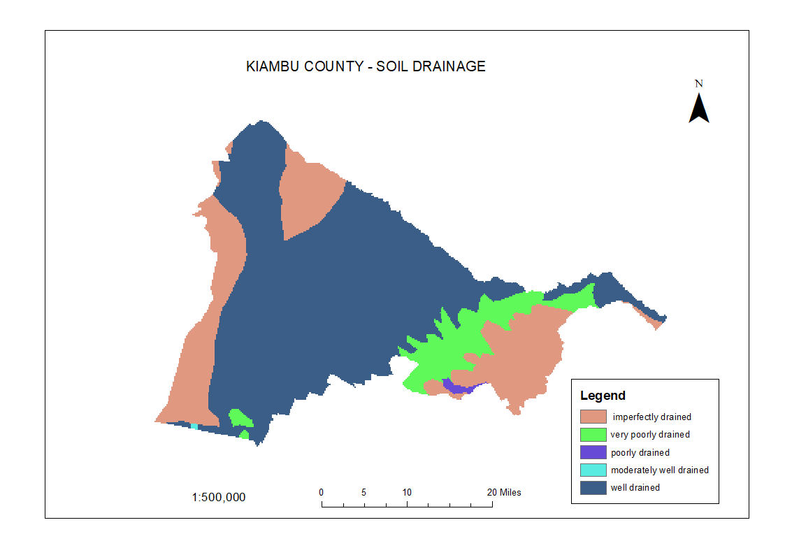
*Drainage Map showing water flow and drainage patterns.*

### Elevation
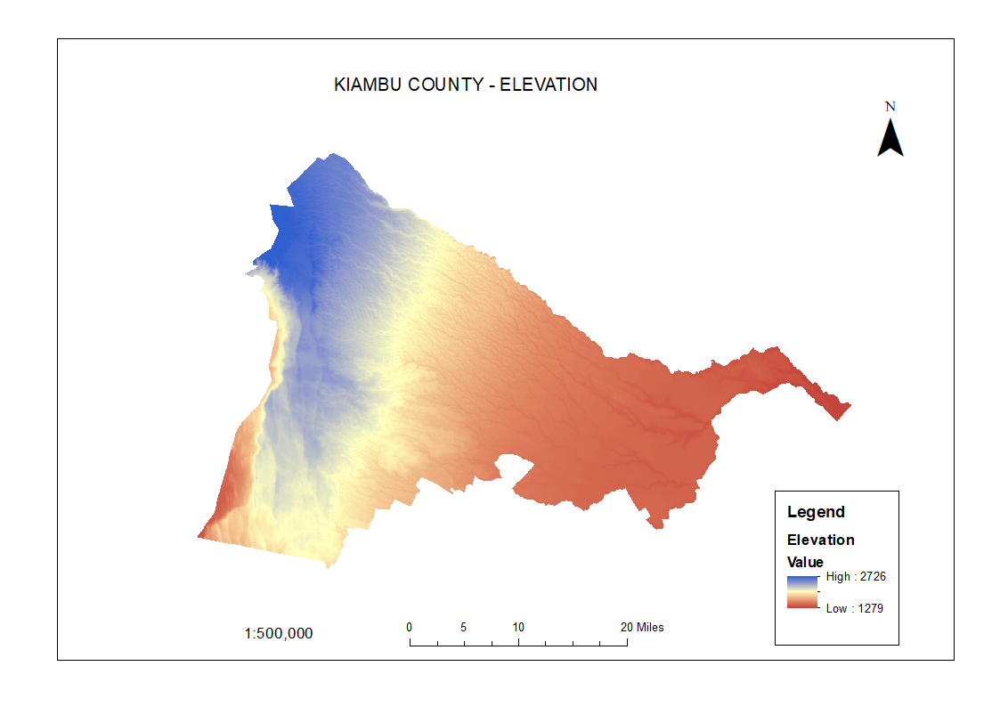
*Elevation Map depicting the topography of the region.*

### New Elevation
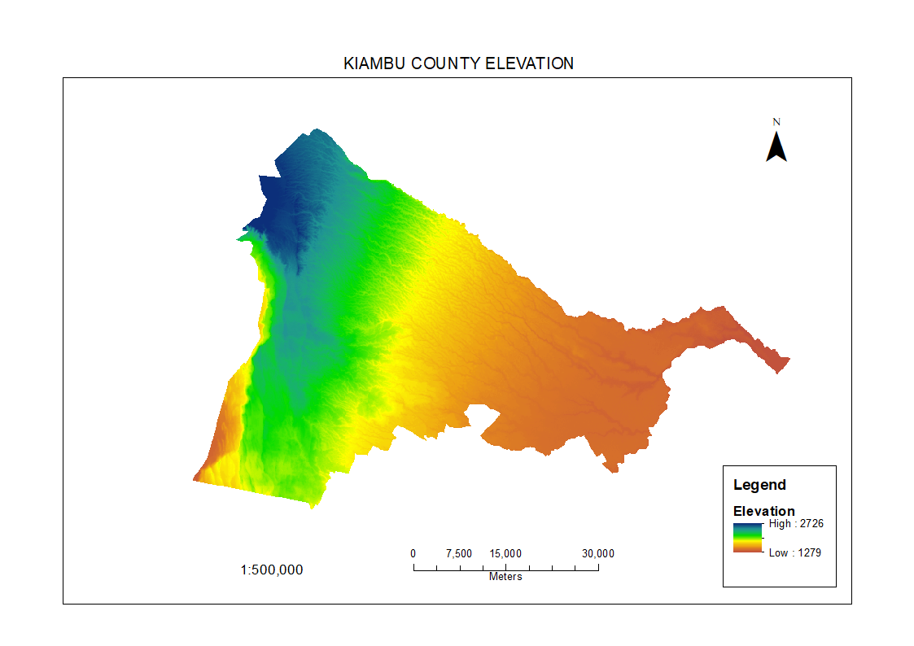
*Updated Elevation Map with refined topographical details.*

### Land Use Land Cover (LULC)
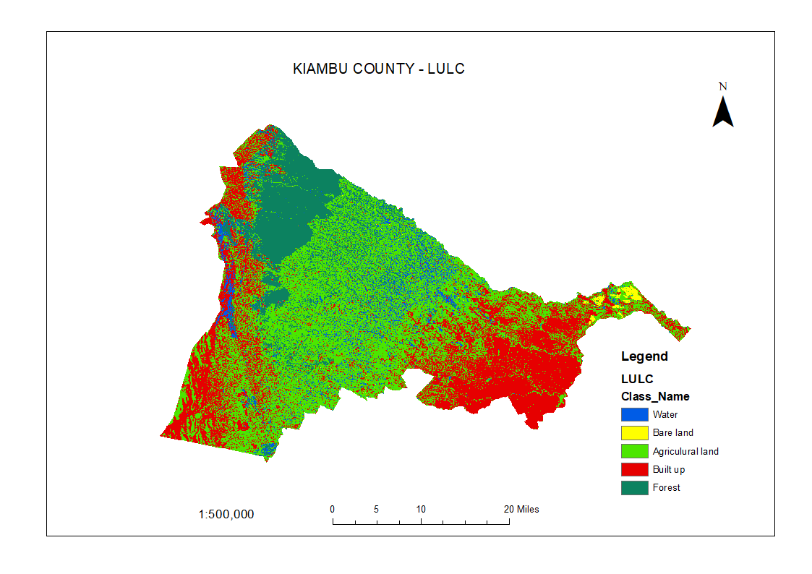
*Land Use Land Cover Map categorizing different land types.*

### Classification
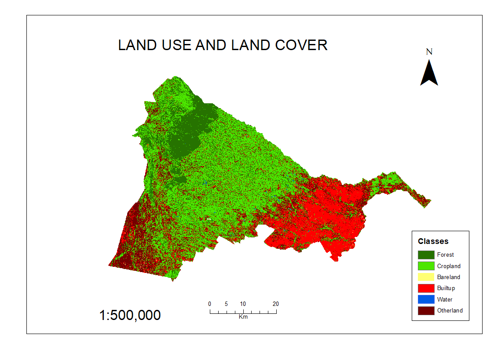
*Classification Map showing various land cover types.*

### pH Levels
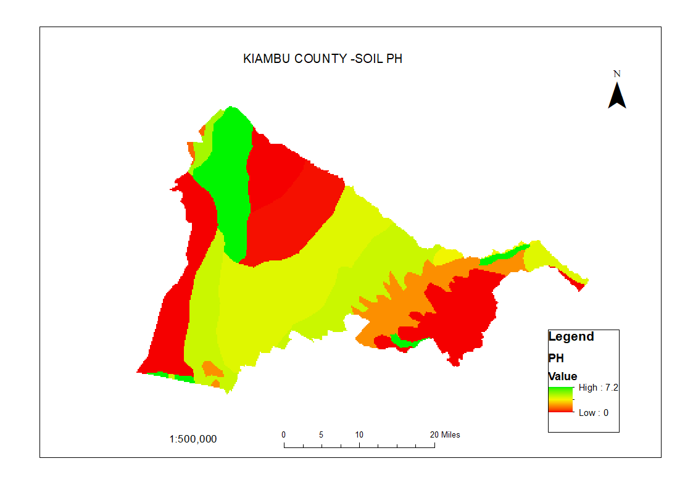
*pH Levels Map displaying soil pH variations.*

### Precipitation
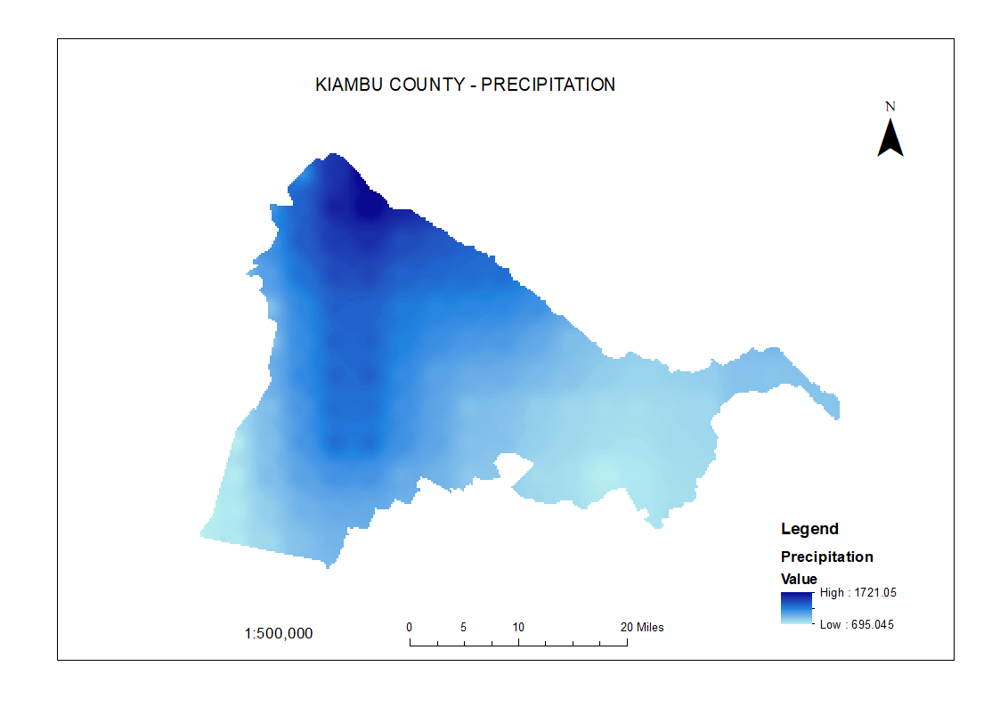
*Precipitation Map indicating rainfall distribution.*

### Rainfall
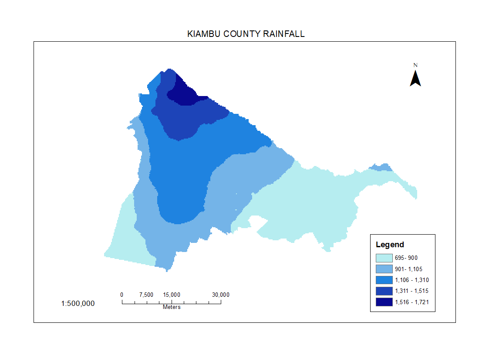
*Rainfall Map illustrating average rainfall across the area.*

### Reclassification
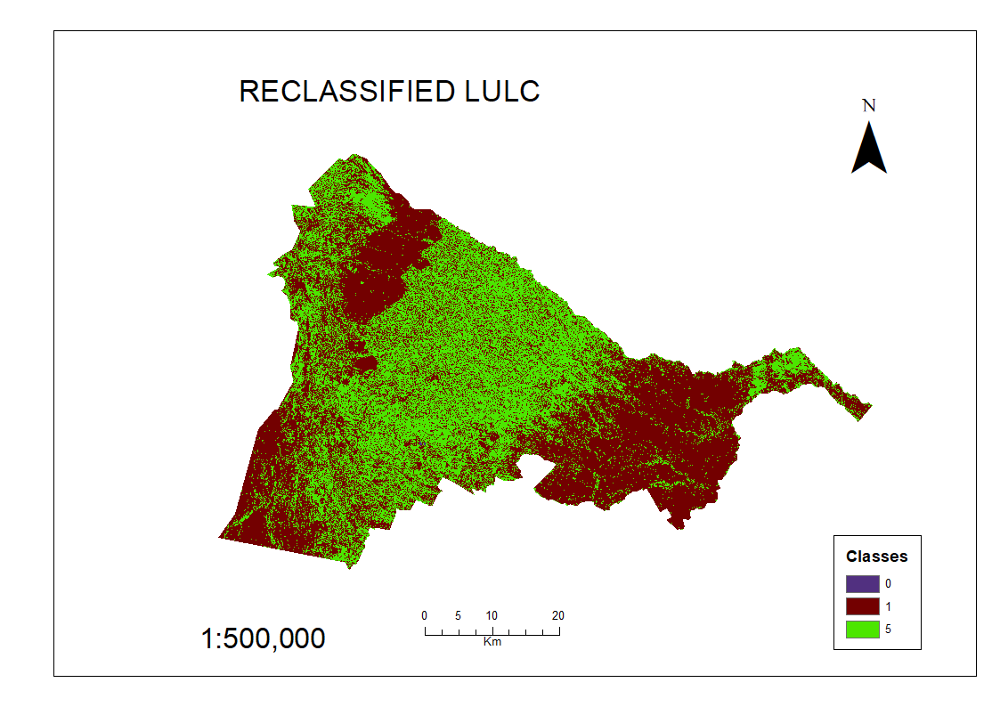
*Reclassification Map showing adjusted land cover classes.*

### Slope
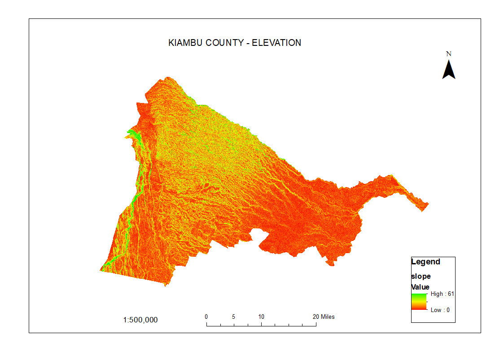
*Slope Map demonstrating terrain steepness.*

### New Slope
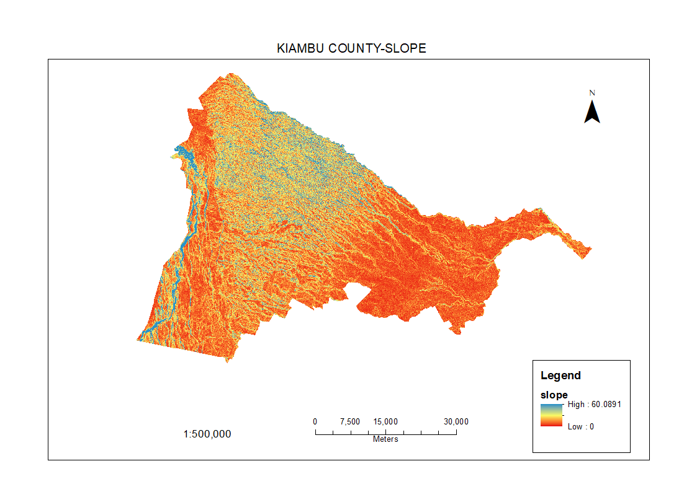
*Updated Slope Map with improved gradient details.*

### Temperature
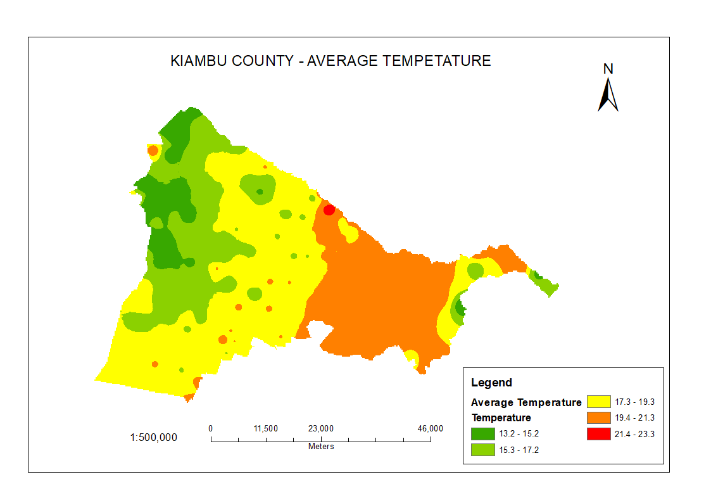
*Temperature Map representing temperature variations.*

### Soil Texture
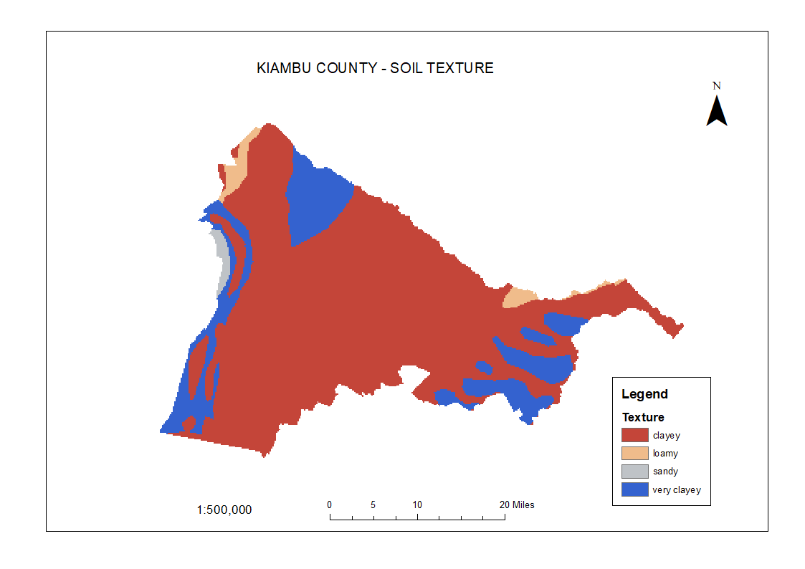
*Soil Texture Map depicting different soil textures.*
